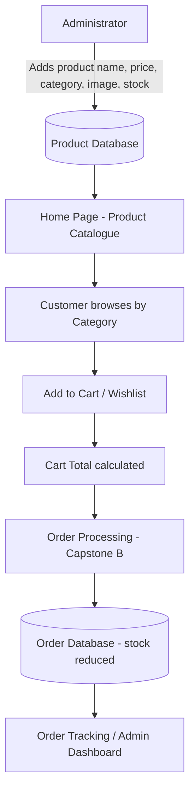
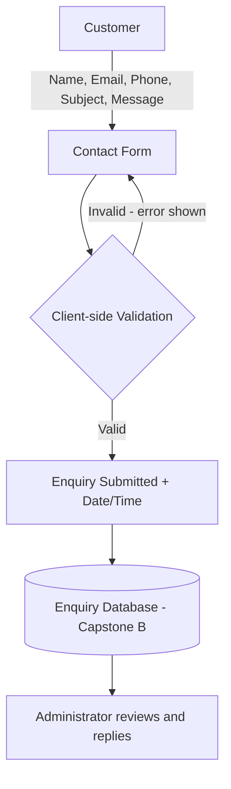

# Week 2 – Project Data Analysis & Planning

**Project:** Secure Retail – Product Catalogue System
**Jira Epic:** Week 2 – Project Data Analysis & Planning

| Team Member | Role | Week 2 Contribution |
|---|---|---|
| Anup Koirala | Project Manager | Data Inventory, Planning answers |
| Kushal Gurung | Designer | Data discovery – About & Contact pages |
| Bibek Pokharel | Reviewer | Pull Request review |
| Sanju Kumar Kushiyiat | Tester | Risk analysis, validation check |
| Ishwor Subedi | Backend Developer | Data Flow Diagrams, docs setup |
| Darshan Paudel | Frontend Developer | Data discovery – Home page |

---

## 1. Module Data Discovery

Data items identified across the Home, About and Contact pages, plus items planned for Capstone B.

| Area | Data Items |
|---|---|
| Product Catalogue (Home) | Product ID, Product Name, Description, Price, Discount/Promo Price, Category, Image, Stock Level, Featured Flag |
| Cart & Wishlist (UI only) | Cart Item (Product ID + Quantity), Cart Total, Wishlist Item |
| Contact Form (Contact) | Full Name, Email, Phone Number, Subject, Message, Submission Date/Time |
| Trust Content (Home/About) | Testimonial Name, Testimonial Text/Rating, Store Statistics, Business Contact Details, Social Media Links |
| Planned – Capstone B | User Account (Username, Email, Password, Role), Order Number & Order Status |

**Total: 25 data items**

---

## 2. Project Data Inventory

| # | Data Item | Purpose | Who Creates It? | Who Uses It? | Required? |
|---|---|---|---|---|---|
| 1 | Product ID | Uniquely identifies each product | System (auto-generated) | System, Administrator | Yes |
| 2 | Product Name | Identifies the product to customers | Administrator | Customers, Administrator | Yes |
| 3 | Product Description | Explains product features | Administrator | Customers | Yes |
| 4 | Product Price | Shows the cost of the product | Administrator | Customers, Cart, Reports | Yes |
| 5 | Discount / Promo Price | Shows reduced price during promotions | Administrator | Customers | No |
| 6 | Product Category | Groups products for browsing | Administrator | Customers, Administrator | Yes |
| 7 | Product Image | Visual display of the product | Administrator | Customers | Yes |
| 8 | Stock Level | Shows product availability | Administrator / Inventory system | Customers, Administrator | Yes |
| 9 | Featured Product Flag | Decides which products appear on the homepage | Administrator | System (Home page) | No |
| 10 | Cart Item (Product ID + Qty) | Tracks what the customer wants to buy | Customer | Customer, Order system | Yes (for checkout) |
| 11 | Cart Total | Shows total cost before checkout | System (calculated) | Customer | Yes |
| 12 | Wishlist Item | Saves products for later | Customer | Customer | No |
| 13 | Customer Full Name | Identifies who sent the enquiry | Customer | Administrator / Support | Yes |
| 14 | Customer Email | Allows the business to reply | Customer | Administrator / Support | Yes |
| 15 | Phone Number | Alternative contact method | Customer | Administrator / Support | No |
| 16 | Enquiry Subject | Categorises the enquiry | Customer | Administrator / Support | Yes |
| 17 | Enquiry Message | The customer's question or issue | Customer | Administrator / Support | Yes |
| 18 | Enquiry Date/Time | Records when the enquiry was sent | System (auto) | Administrator, Reports | Yes |
| 19 | Testimonial Name | Shows who gave the review | Customer (approved by Admin) | Visitors | Yes (if shown) |
| 20 | Testimonial Text / Rating | Builds trust through social proof | Customer (approved by Admin) | Visitors | Yes (if shown) |
| 21 | Store Statistics | Shows business credibility | System / Administrator | Visitors | No |
| 22 | Business Contact Details | Lets customers reach the store | Administrator | Customers | Yes |
| 23 | Social Media Links | Connects customers to social channels | Administrator | Customers | No |
| 24 | User Account (Username, Email, Password, Role) | Login and access control *(Capstone B)* | Customer / Administrator | System, Administrator | Yes |
| 25 | Order Number & Status | Tracks customer orders *(Capstone B)* | System | Customer, Administrator | Yes |

---

## 3. Data Flow Diagrams

### Flow A – Product Browsing & Cart (Purchase Journey)

### Flow B – Contact Enquiry (Current Implementation)

**Stages:** Input → Processing (validation / calculation) → Storage (database) → Display (pages, dashboard, reports)

---
## 4. Data Quality & Risk Analysis

| # | Data Item | Risk | Business Impact | Prevention Strategy |
|---|---|---|---|---|
| 1 | Product Price | Incorrect value entered | Customers overcharged/undercharged, financial loss | Numeric validation, min/max range, admin review |
| 2 | Discount Price | Discount higher than original price or never expires | Products sold at a loss | Rule: discount < price; promotion start/end dates |
| 3 | Stock Level | Not updated after a sale | Out-of-stock items sold, cancelled orders | Automatic stock reduction on order; low-stock alerts |
| 4 | Product Category | Wrong category assigned | Customers can't find products, lost sales | Fixed dropdown list of categories |
| 5 | Product Image | Missing or broken image | Unprofessional appearance, loss of trust | Required field, placeholder fallback, file type/size checks |
| 6 | Product ID | Duplicate IDs | Wrong product added to cart/order | Auto-generated unique primary key |
| 7 | Cart Quantity | Zero, negative or unrealistic amount | Incorrect totals, order errors | Whole numbers, min 1, max limited by stock |
| 8 | Cart Total | Manipulated on client side | Customer pays wrong amount (security risk) | Recalculate total on server before checkout |
| 9 | Customer Email | Invalid format or typo | Business cannot reply, lost customer | Email format validation; confirmation email |
| 10 | Enquiry Message | Empty, spam or malicious script (XSS) | Wasted staff time, security attack | Required field, length limit, input sanitisation, CAPTCHA |
| 11 | Phone Number | Letters or wrong length | Staff cannot call customer back | Pattern validation (digits, Australian format) |
| 12 | User Password *(Capstone B)* | Weak or stored as plain text | Account hacking, data breach, Privacy Act penalties | Strong password rules, hashing (bcrypt) |
| 13 | Testimonial Text | Fake or unapproved reviews shown | Misleading customers, reputation damage | Admin approval before display |
| 14 | Customer Personal Data | Unauthorised access | Privacy breach, loss of trust | Role-based access, HTTPS, secure storage |

---
## 5. Planning for Future Development

### What information should be stored permanently?
- Product records (ID, name, description, category, image)
- User accounts (name, email, hashed password, role)
- Order history (order number, items, totals, dates)
- Customer enquiries
- Approved testimonials
- Business contact details

### What information changes frequently?
- Stock levels
- Prices and promotional prices
- Featured products
- Cart and wishlist contents (temporary / session data)
- Cart totals
- Order status (Pending → Paid → Shipped → Delivered)
- Store statistics

### What information should be restricted to administrators?
- Creating/editing/deleting products, prices and stock
- Customer personal data and enquiry messages
- Order and payment records
- User accounts and roles
- Testimonial approval
- Sales and revenue reports

### What information should be included in future reports?
- Total sales and revenue (daily / weekly / monthly)
- Best-selling products and categories
- Low-stock and out-of-stock products
- New customers and active users
- Number of enquiries and response times
- Most wishlisted products

### What information might be required in Capstone B Version 2?
- User registration and login
- Full cart and checkout (order number, items, quantities, totals)
- Payment status (via payment gateway – no card numbers stored)
- Shipping address, tracking number, delivery status, shipping date
- Product search and filter data
- Admin dashboard data (total orders, active users, revenue)
- Audit logs (who changed prices/stock and when)

---

## 6. Review Log

| Date | Reviewer | Comment | Action Taken |
|---|---|---|---|
| | | | |
| | | | |

