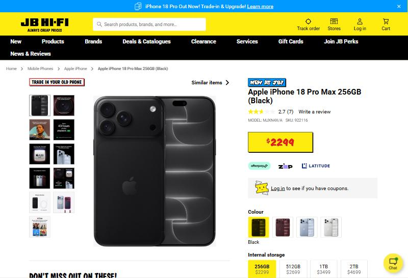
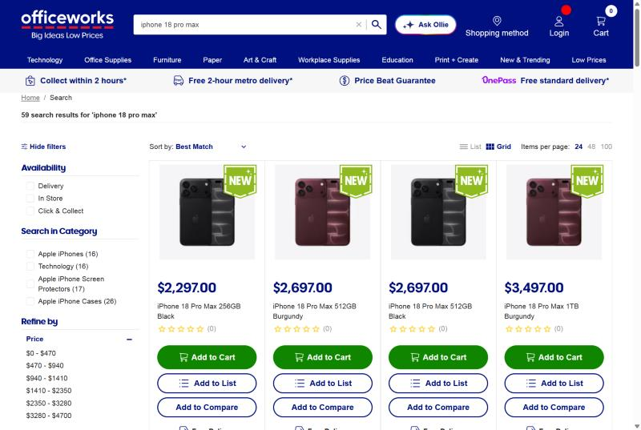
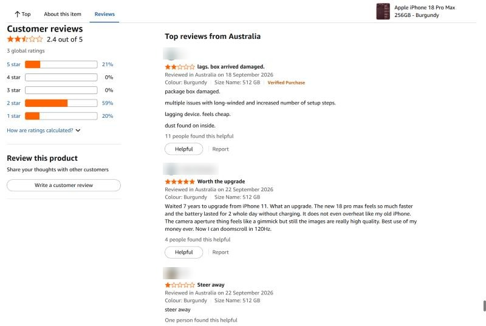

# Week 3 – Industry Investigation & Data Discovery

**Project:** Secure Retail – Product Catalogue System
**Investigation type:** Option B – Online Investigation (30 September 2026)
**Product used for comparison:** iPhone 18 Pro Max (256GB)

Full report: [Week3_Investigation_Report.docx](Week3_Investigation_Report.docx) · Evidence: [evidence/](evidence/)

---

## Task 1 – Organisations Investigated

| Organisation | Type | Key Findings |
|---|---|---|
| JB Hi-Fi | Online electronics retailer | 16 results, $2,299–$4,699; 2.7★ (7 reviews); stock by postcode; 30+ spec fields; price-match (JB Deal); limit 2 per customer |
| Officeworks | Online office & tech retailer | 59 results; $2,297–$4,697; filters by Delivery / In Store / Click & Collect; Pick up in-store vs Deliver; 365-day returns; AI assistant "Ollie" |
| Amazon AU | Online marketplace | Many filters (Prime, delivery day, condition, seller); 2.4★ with star breakdown and Verified Purchase; out-of-stock pre-order; 30-day returns; Buy Now |

## Task 2 – Data Discovery (25 items)

| # | Data Item | Why Is It Important? | Who Uses It? |
|---|---|---|---|
| 1 | Product Name / Title | Identifies the product in search results | Customers, Staff |
| 2 | Product Price | Supports purchasing decisions | Customers, Finance |
| 3 | Variant Price | Shows cost difference between options | Customers |
| 4 | Product Variants (colour, storage) | Customer picks exact version | Customers, Inventory |
| 5 | SKU / Model / Product Code | Uniquely identifies stock | Staff, Inventory system |
| 6 | Product Images / Video | Customers see the product before buying | Customers |
| 7 | Specifications | Detailed feature comparison | Customers |
| 8 | Product Category | Browsing and filtering | Customers, Admin |
| 9 | Average Star Rating | Quick signal of quality | Customers, Managers |
| 10 | Review Count | Shows how reliable the rating is | Customers |
| 11 | Rating Breakdown | Shows the spread of opinions | Customers, Managers |
| 12 | Review Text + Verified Purchase | Builds trust | Customers, Admin |
| 13 | Stock Level / Availability | Prevents selling unavailable items | Customers, Inventory |
| 14 | Store Location / Postcode | Local stock and delivery options | Customers, Logistics |
| 15 | Fulfilment Method | Delivery or Click & Collect | Customers, Store staff |
| 16 | Delivery Cost | Affects total price | Customers, Finance |
| 17 | Estimated Delivery Date | Sets expectations | Customers, Logistics |
| 18 | Promotion / Discount | Drives sales | Customers, Marketing |
| 19 | Purchase Limit per Customer | Stops bulk buying | System, Staff |
| 20 | Payment Methods | Flexible, trusted payment | Customers, Finance |
| 21 | Warranty Period | Purchase confidence | Customers, Support |
| 22 | Returns Policy | Reduces purchase risk | Customers, Support |
| 23 | Seller / Shipper | Who the customer buys from | Customers |
| 24 | Wishlist Items | Saves products, shows demand | Customers, Marketing |
| 25 | Order Number / Tracking Status | Follow delivery | Customers, Support |

## Task 3 – Module Summary: What helps customers choose products?

1. **Price and value:** price per variant, promotions, price-match, flexible payment.
2. **Product details:** image gallery, key features, full specifications, SKU.
3. **Social proof:** star rating, review count, rating breakdown, verified reviews, Q&A.
4. **Availability and delivery:** stock by location, click & collect, delivery cost and date.
5. **Finding and comparing:** search, filters, sort, compare, recommendations.

## Task 4 – User Insights

Three (student, small business owner, retiree) were interviewed. Key themes: clear price and stock information, different trust signals per user type, time-saving filters and delivery dates, and accessibility. Real interviews will be added to the report.

## Task 5 – Gap Analysis (summary)

| Our MVP | Industry System | Missing Opportunity |
|---|---|---|
| Featured products only | Full search with results count | Product search |
| Browse by category | Price, availability, brand, rating filters | Filters and sorting |
| Product cards only | Product page with gallery and specs | Product detail page |
| One price per product | Variants with own price | Variant pricing |
| Store testimonials | Product reviews with breakdown | Product reviews |
| No stock info | Stock by location, out-of-stock messages | Stock level |
| No delivery info | Delivery cost, date, click & collect | Delivery options |
| Cart/Wishlist UI only | Working cart, saved wishlist, Buy Now | Functional cart + accounts |
| No accounts / tracking | Sign in, track my order | User accounts, order tracking |

## Task 6 – Version 2 Priorities (MoSCoW)

**Must Have:** 
.product search
· product detail page with specs & SKU 
· stock level · secure user accounts 
· functional cart 
· variant pricing
**Should Have:** 
.filters & sorting 
· product reviews & ratings 
· delivery & returns info
· wishlist saved to account
· order tracking
**Nice To Have:** 
.product comparison 
· click & collect / store stock
· recommendations 
· notify when back in stock 
· live chat / AI assistant 
· Buy Now

