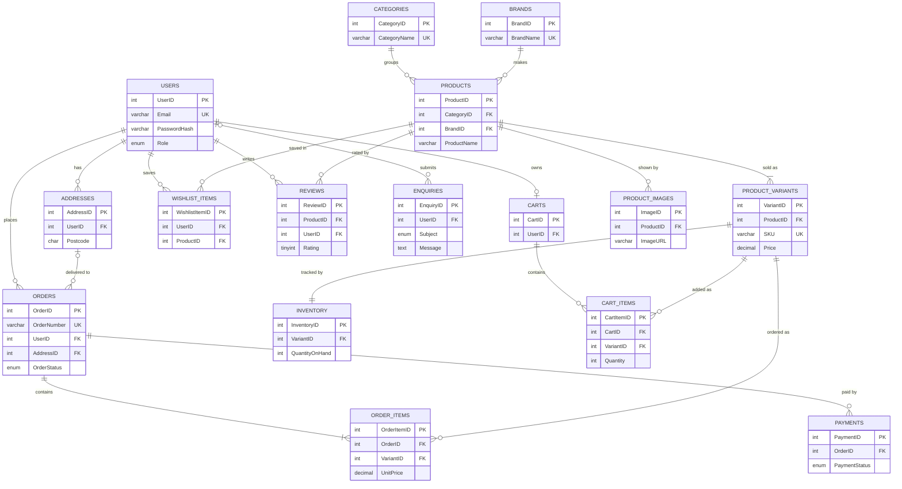

# Week 4 – Relationship Map

**Project:** Secure Retail – Product Catalogue System

This document lists every relationship in the [ERD](erd.png), with its cardinality and the foreign key that implements it.

## Cardinality notation

| Symbol (crow's foot) | Meaning |
|---|---|
| `\|\|` | Exactly one |
| `\|o` | Zero or one |
| `}\|` | One or many |
| `}o` | Zero or many |

## Relationship definitions

| # | Entity A | Relationship | Entity B | Type | Cardinality (read both ways) | Foreign Key | On Delete |
|---|---|---|---|---|---|---|---|
| R1 | USERS | has | ADDRESSES | 1:M | A user has zero or many addresses. Each address belongs to exactly one user. | ADDRESSES.UserID | CASCADE |
| R2 | USERS | owns | CARTS | 1:1 (optional) | A user owns zero or one cart. Each cart belongs to exactly one user. | CARTS.UserID (unique) | CASCADE |
| R3 | USERS | saves | WISHLIST_ITEMS | 1:M | A user saves zero or many wishlist items. Each item belongs to exactly one user. | WISHLIST_ITEMS.UserID | CASCADE |
| R4 | USERS | writes | REVIEWS | 1:M | A user writes zero or many reviews. Each review is written by exactly one user. | REVIEWS.UserID | RESTRICT |
| R5 | USERS | places | ORDERS | 1:M | A user places zero or many orders. Each order is placed by exactly one user. | ORDERS.UserID | RESTRICT |
| R6 | USERS | submits | ENQUIRIES | 1:M (optional) | A user submits zero or many enquiries. An enquiry belongs to zero or one user (guests can submit). | ENQUIRIES.UserID (nullable) | SET NULL |
| R7 | ADDRESSES | delivered to | ORDERS | 1:M (optional) | An address is used by zero or many orders. An order has zero or one address (none for Click & Collect). | ORDERS.AddressID (nullable) | RESTRICT |
| R8 | CATEGORIES | groups | PRODUCTS | 1:M | A category groups zero or many products. Each product is in exactly one category. | PRODUCTS.CategoryID | RESTRICT |
| R9 | BRANDS | makes | PRODUCTS | 1:M | A brand makes zero or many products. Each product has exactly one brand. | PRODUCTS.BrandID | RESTRICT |
| R10 | PRODUCTS | sold as | PRODUCT_VARIANTS | 1:M | A product is sold as one or many variants. Each variant belongs to exactly one product. | PRODUCT_VARIANTS.ProductID | RESTRICT |
| R11 | PRODUCTS | shown by | PRODUCT_IMAGES | 1:M | A product is shown by zero or many images. Each image belongs to exactly one product. | PRODUCT_IMAGES.ProductID | CASCADE |
| R12 | PRODUCTS | rated by | REVIEWS | 1:M | A product receives zero or many reviews. Each review is about exactly one product. | REVIEWS.ProductID | RESTRICT |
| R13 | PRODUCTS | saved in | WISHLIST_ITEMS | 1:M | A product appears in zero or many wishlist items. Each item refers to exactly one product. | WISHLIST_ITEMS.ProductID | CASCADE |
| R14 | PRODUCT_VARIANTS | tracked by | INVENTORY | 1:1 | Each variant has exactly one inventory record, and each inventory record tracks exactly one variant. | INVENTORY.VariantID (unique) | CASCADE |
| R15 | CARTS | contains | CART_ITEMS | 1:M | A cart contains zero or many items. Each item belongs to exactly one cart. | CART_ITEMS.CartID | CASCADE |
| R16 | PRODUCT_VARIANTS | added as | CART_ITEMS | 1:M | A variant is in zero or many cart items. Each cart item refers to exactly one variant. | CART_ITEMS.VariantID | CASCADE |
| R17 | ORDERS | contains | ORDER_ITEMS | 1:M | An order contains one or many items. Each item belongs to exactly one order. | ORDER_ITEMS.OrderID | RESTRICT |
| R18 | PRODUCT_VARIANTS | ordered as | ORDER_ITEMS | 1:M | A variant appears in zero or many order items. Each order item refers to exactly one variant. | ORDER_ITEMS.VariantID | RESTRICT |
| R19 | ORDERS | paid by | PAYMENTS | 1:M | An order has zero or many payment attempts. Each payment is for exactly one order. | PAYMENTS.OrderID | RESTRICT |

**On Delete** is the MySQL foreign key action:

- **CASCADE** – the child rows are deleted with the parent. Used only for data with no history value, such as cart items and images.
- **RESTRICT** – the parent cannot be deleted while children exist. Used to protect orders, payments and reviews; records are deactivated with `IsActive` instead.
- **SET NULL** – the link is removed but the child row is kept.

## Many-to-many relationships and how they are resolved

Relational databases cannot store many-to-many relationships directly, so each one is resolved with an associative (junction) table.

| Many-to-many relationship | Junction table | Extra data stored on the junction |
|---|---|---|
| USERS ↔ PRODUCTS (wishlist) | WISHLIST_ITEMS | AddedAt |
| USERS ↔ PRODUCTS (reviews) | REVIEWS | Rating, Title, Comment, IsVerifiedPurchase, Status |
| CARTS ↔ PRODUCT_VARIANTS | CART_ITEMS | Quantity, AddedAt |
| ORDERS ↔ PRODUCT_VARIANTS | ORDER_ITEMS | Quantity, UnitPrice, LineTotal |

## Relationship types used

| Type | Example in our design |
|---|---|
| One-to-One (1:1) | PRODUCT_VARIANTS → INVENTORY; USERS → CARTS (optional) |
| One-to-Many (1:M) | USERS → ORDERS; CATEGORIES → PRODUCTS; ORDERS → ORDER_ITEMS |
| Many-to-Many (M:M) | ORDERS ↔ PRODUCT_VARIANTS, resolved through ORDER_ITEMS |

## ERD source (Mermaid)

GitHub displays this block as a diagram, so the relationships can be read directly in the repository. The styled version is [erd.png](erd.png).

*The Mermaid version shows key fields only. Full attributes are in [erd.png](erd.png) and the [Data Dictionary](data-dictionary.md).*
